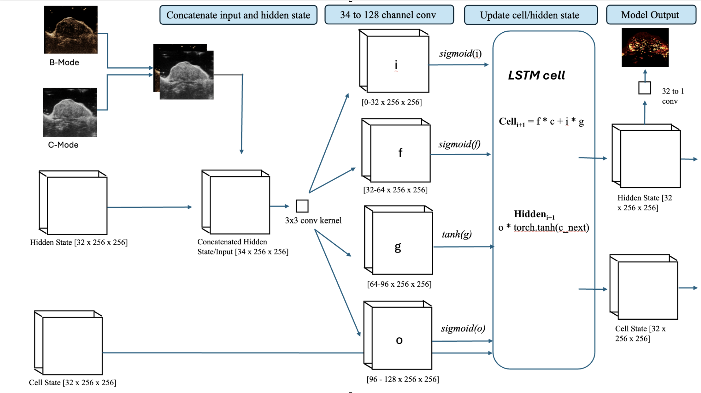
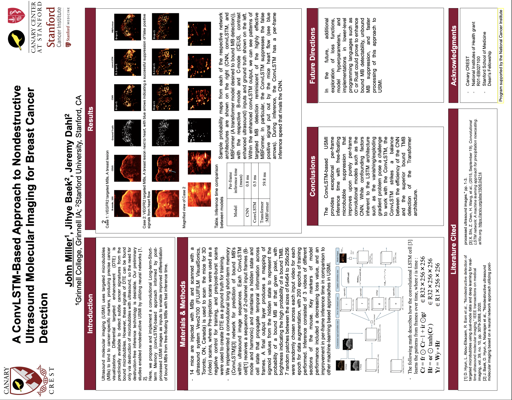

# LSTM Research Repository

A PyTorch implementation of Convolutional LSTM (ConvLSTM) for spatial-temporal data processing, designed for microbubble detection on 
B-mode adn C-mode images. The repository doesn't contain the underlying data and training loop out of respect for the proprietary nature
of the data not belonging to me, however, this repositiory exists to showcase the underlying LSTM architecture for data pipelining and parameter
tuning that I learned and subsequently built. 


## 📋 Overview

This repository contains a documented, modularized model architecture for 

## 🏗️ Architecture

### Model Components

- **[ConvLSTMCell](./convLSTMcell.py)** - Core ConvLSTM cell implementation with gating mechanisms
- **[ConvLSTM](./convLSTM.py)** - Full network wrapper with output projection layer

### Architecture Diagram


## Research Documentation

📋 **[Research Report (PDF)](./Miller_John_Report.pdf)** - technical documentation and analysis

## 📊 Research Poster



## Installation

```bash
# Clone the repository
git clone https://github.com/yourusername/LSTM-research-repo.git
cd LSTM-research-repo

# Install dependencies
pip install torch torchvision
```


### Basic Usage

```python
import torch
from convLSTM import ConvLSTM

# Initialize the model
model = ConvLSTM(input_channels=2, hidden_channels=32)

# Process input data
input_tensor = torch.randn(1, 2, 256, 256)  # (batch, channels, height, width)
output, hidden_states = model(input_tensor)

print(f"Output shape: {output.shape}")  # (1, 1, 256, 256)

# For processing sequences
model = ConvLSTM(input_channels=2, hidden_channels=32)
hidden = None

for frame in sequence:
    output, (hidden, cell) = model(frame, hidden, cell)
    # Process output, and reuse the new hidden and cell state for the next iteration...
```
